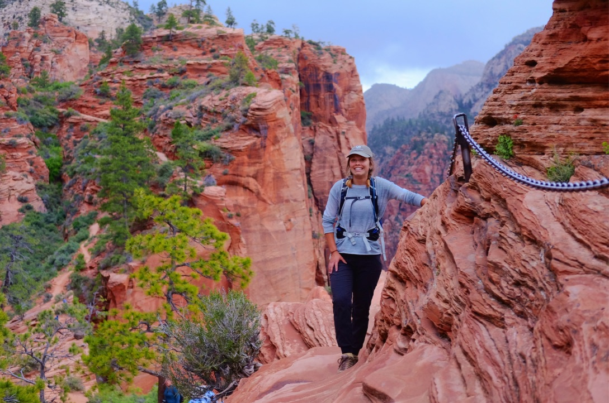
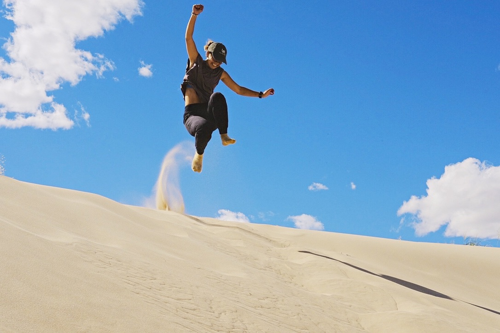
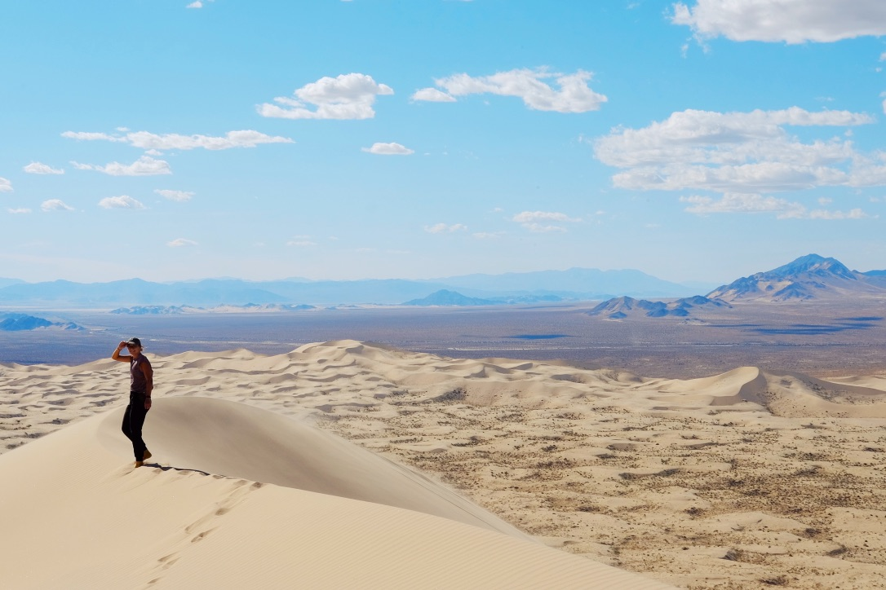
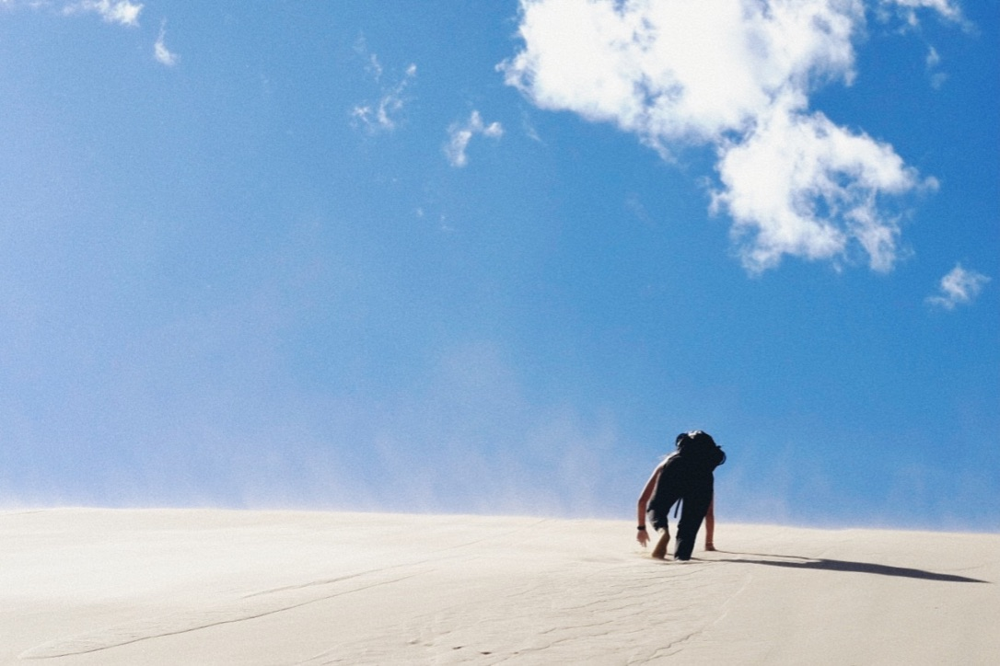

## Claremont, California

Driving away from Claremont hit me harder than I would have anticipated.

## Kelso Dunes, California

The wind

## Red Rocks National Conservation Area, Nevada

Relying on Susana 

## Zion National Park, Utah

My confusion regarding Ada's taking my photo quickly devolved into angst-ridden doubt

Zion may in fact be one of the more idyllic places on Earth. 

## Angels Landing Hike

The smile of someone who has spent the past hour peering of the edge into certain death

[https://open.spotify.com/track/2ihrzjkisJGNcaulKO8Bgq?si=V7z5tIfATx-VSES5Q6YYCA](https://open.spotify.com/track/2ihrzjkisJGNcaulKO8Bgq?si=V7z5tIfATx-VSES5Q6YYCA)

[https://open.spotify.com/track/4LpFCIk7FN7mL7xvNPdeJj?si=Zc4gfxTtSaWwoFHm1m80HQ](https://open.spotify.com/track/4LpFCIk7FN7mL7xvNPdeJj?si=Zc4gfxTtSaWwoFHm1m80HQ)

[https://open.spotify.com/track/2E01rRrzaz6TuwCdm27m4m?si=VPJmfenqTX6IjZPUx_jt2Q](https://open.spotify.com/track/2E01rRrzaz6TuwCdm27m4m?si=VPJmfenqTX6IjZPUx_jt2Q)

## Lake Powell, Utah