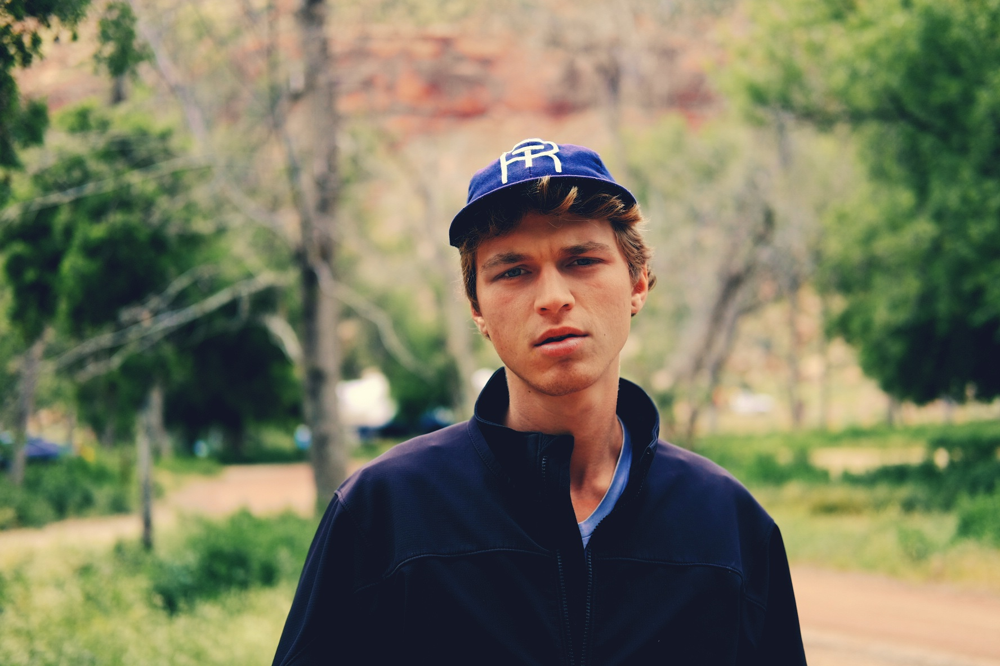
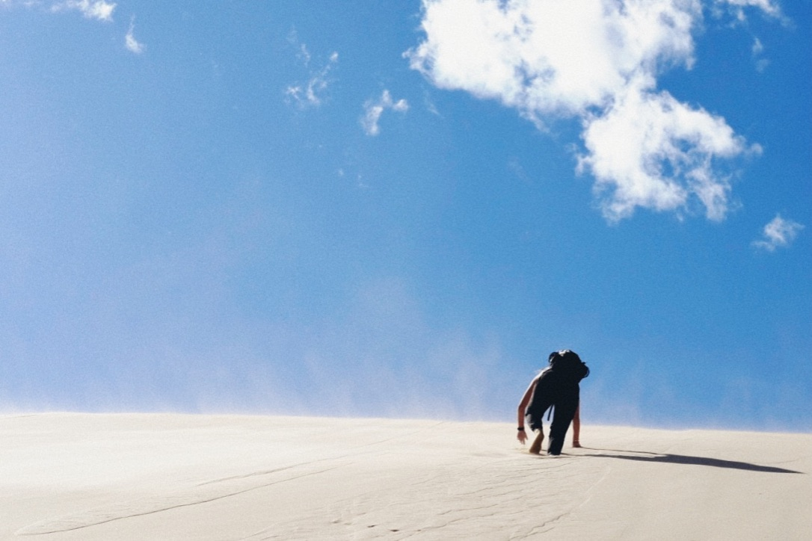

The news can be defined as information about events, individuals, and forces
outside the realm of one’s immediate, knowable reality. The news media, then,
are the means, methods, and mediums (media being the alternative plural) by
which this information transfers from its origin “out there” to you. I highlight
this process of information transfer because the incredible capacities afforded
by digital technology have obscured it so well. Information arrives instantly,
making it seem as if it never traveled at all. Information arrives unrefined and
raw, making it seem objective. And information can be produced by anyone, making
it seem democratic, equal, and fair.

But it is important to remember that “technological affordance,” a key concept
of Zeynep Tufekci’s, is nothing more than that, just a possibility. Technology
itself does not do anything. That being said, Jodi Dean cautions us with
technological historian Melvin Kranzberg’s first law of technology, “Technology
is neither good nor bad, neither is it neutral.” Much like proponents of
firearms point out that “guns don’t kill people, people kill people,” tech
executives often cite their product’s passivity as a way to deflect
responsibility — “Facebook is just a platform,” Google’s “Don’t be evil,” etc.
Just because technology does not act itself, it still establishes the boundaries
of those who do by “altering the social architecture of visibility, access, and
community.”

In the last decade, many of these alterations have occurred at such
unprecedented scale, the landscape they have rendered seems littered with
contradiction. The internet has provided so much information, what it has really
caused, according to Dean, is a scarcity of knowledge. When quantity of
knowledge no longer becomes an issue, veracity does. Tufekci provides an
illustrative example. She describes the life cycle of a
[140journos](https://140journos.com/), a crowdsourced journalism collective that
came to life around 2012, when Turkey was persecuting the Kurdish people in the
south with military violence, but the state owned media was, of course, not
covering any of it. Though the logistics were difficult and the danger high,
140journos mission started out very simple: use Twitter to get around government
censorship.

In the last few years, 140journos has had to pause operations and reconsider
what value they can continue to provide. Just in the last five years, the
digital news landscape had shifted underneath their feet. They used to have to
probe huge webs of contacts to find some one who could photograph, film, or
report on the events the government was trying to censor. Now, news goes viral
before they even know it is happening. Within a matter of minutes, photos can be
shared, altered, faked. Trolls descend seemingly out of nowhere, simply to
relish in the chaos. Bots amplify the most outrageous players. Any attempt to
add original reporting would only be lost to a torrent of noise.

The news can be defined as information about events, individuals, and forces
outside the realm of one’s immediate, knowable reality. The news media, then,
are the means, methods, and mediums (media being the alternative plural) by
which this information transfers from its origin “out there” to you. I highlight
this process of information transfer because the incredible capacities afforded
by digital technology have obscured it so well. Information arrives instantly,
making it seem as if it never traveled at all. Information arrives unrefined and
raw, making it seem objective. And information can be produced by anyone, making
it seem democratic, equal, and fair.

But it is important to remember that “technological affordance,” a key concept
of Zeynep Tufekci’s, is nothing more than that, just a possibility. Technology
itself does not do anything. That being said, Jodi Dean cautions us with
technological historian Melvin Kranzberg’s first law of technology, “Technology
is neither good nor bad, neither is it neutral.” Much like proponents of
firearms point out that “guns don’t kill people, people kill people,” tech
executives often cite their product’s passivity as a way to deflect
responsibility — “Facebook is just a platform,” Google’s “Don’t be evil,” etc.
Just because technology does not act itself, it still establishes the boundaries
of those who do by “altering the social architecture of visibility, access, and
community.”

In the last decade, many of these alterations have occurred at such
unprecedented scale, the landscape they have rendered seems littered with
contradiction. The internet has provided so much information, what it has really
caused, according to Dean, is a scarcity of knowledge. When quantity of
knowledge no longer becomes an issue, veracity does. Tufekci provides an
illustrative example. She describes the life cycle of a
[140journos](https://140journos.com/), a crowdsourced journalism collective that
came to life around 2012, when Turkey was persecuting the Kurdish people in the
south with military violence, but the state owned media was, of course, not
covering any of it. Though the logistics were difficult and the danger high,
140journos mission started out very simple: use Twitter to get around government
censorship.

In the last few years, 140journos has had to pause operations and reconsider
what value they can continue to provide. Just in the last five years, the
digital news landscape had shifted underneath their feet. They used to have to
probe huge webs of contacts to find some one who could photograph, film, or
report on the events the government was trying to censor. Now, news goes viral
before they even know it is happening. Within a matter of minutes, photos can be
shared, altered, faked. Trolls descend seemingly out of nowhere, simply to
relish in the chaos. Bots amplify the most outrageous players. Any attempt to
add original reporting would only be lost to a torrent of noise.

## Claremont, California

Driving away from Claremont hit me harder than I would have anticipated.

## Kelso Dunes, California

The wind

## Red Rocks National Conservation Area, Nevada

Relying on Susana

## Zion National Park, Utah

My confusion regarding Ada's taking my photo quickly devolved into angst-ridden doubt

Zion may in fact be one of the more idyllic places on Earth.

## Angels Landing Hike

The smile of someone who has spent the past hour peering of the edge into certain death

[https://open.spotify.com/track/2ihrzjkisJGNcaulKO8Bgq?si=V7z5tIfATx-VSES5Q6YYCA](https://open.spotify.com/track/2ihrzjkisJGNcaulKO8Bgq?si=V7z5tIfATx-VSES5Q6YYCA)

[https://open.spotify.com/track/4LpFCIk7FN7mL7xvNPdeJj?si=Zc4gfxTtSaWwoFHm1m80HQ](https://open.spotify.com/track/4LpFCIk7FN7mL7xvNPdeJj?si=Zc4gfxTtSaWwoFHm1m80HQ)

[https://open.spotify.com/track/2E01rRrzaz6TuwCdm27m4m?si=VPJmfenqTX6IjZPUx_jt2Q](https://open.spotify.com/track/2E01rRrzaz6TuwCdm27m4m?si=VPJmfenqTX6IjZPUx_jt2Q)

## Lake Powell, Utah
