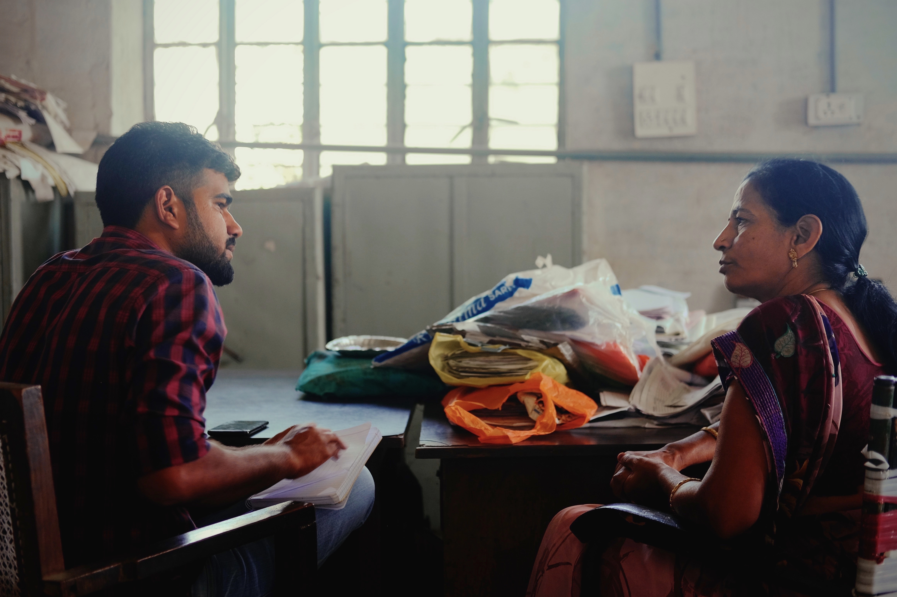

---
template:
- writing

title: "The Accountability Initiative"
date: 2019-10-21
city: Jaipur
country: India
description: >

tags:
  - Field Work
  - Language Barrier
  - Data Collection
  - Social Science
---

import Citation from "../../src/components/citation"

## Accountability Initiative

The field team consisted of three young men, Taju, Ram, and Vinod. Two of them were Rajasthan natives, and the third, Vinod, had come in from Himachal Pradesh to help with the work load. The task at hand was interviewing a group of women known as "Lady Supervisors." Lady Supervisors, often abbreviated LS, are women whose job it is to oversee

## Taju & Vinod

## Lady Supervisors

## Wanderings

 
