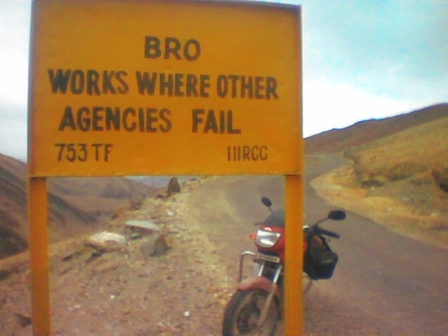

## **The Major Players**

---

## UIDAI

#### Unique Identification Authority of India

## NPCI

#### National Payments Corporation of India

## BHIM (w/ w/o Aadhaar Pay)

#### Bharat Interface for Money

## UPI

#### Unified Payment Interface

## GST / GSTN

#### Goods and Services Tax (Network)

## TRAI

#### Telecom Regulatory Authority of India

## RBI

#### Royal Bank of India

## NRC

#### National Registry of Citizens

## PDS

#### Public Distribution Center

## KYC

#### Know Your Customer

## PAN

#### Personal Account Number

## iSPIRT

#### Indian Software Product Industry RoundTable

I know this doesn't even seem like an acronym, but it is! Just like Google, kidding.

## CSO

#### Central Statistics Office

## RTI

#### Right To Information

## NREGA

#### National Rural Employment Guarantee Act 

## **People and Places**

---

## PM

#### Prime Minister

## CM

#### Chief Minister

## MP

#### Member of Parliament

## BJP

#### Bharatiya Janata Party

## SC

#### Supreme Court

## OBC

#### Otherwise Backwards Classes

## NRI

#### Non-Resident Indian

## UP / MP / AP

#### Uttar Pradesh

This one applies to any Pradesh, really. Pradesh roughly translates to “province” or “state.”

## IIM

#### Indian Institute of Management

## IIT

#### Indian Institute of Technology

## CSC

#### Common Service Centers

## **The Most Enjoyable**

---

## NPR

#### National Population Register

NPR no longer means National Public Radio 😭

## CIDR

#### Central Identities Data Repository

## ABBA

#### Aadhaar-based Biometric Authentication

## OTP

#### One Time Password

## **The Undisputed Best Acronym (TUBA)**

---

## BRO

#### Boarder Roads Organization

