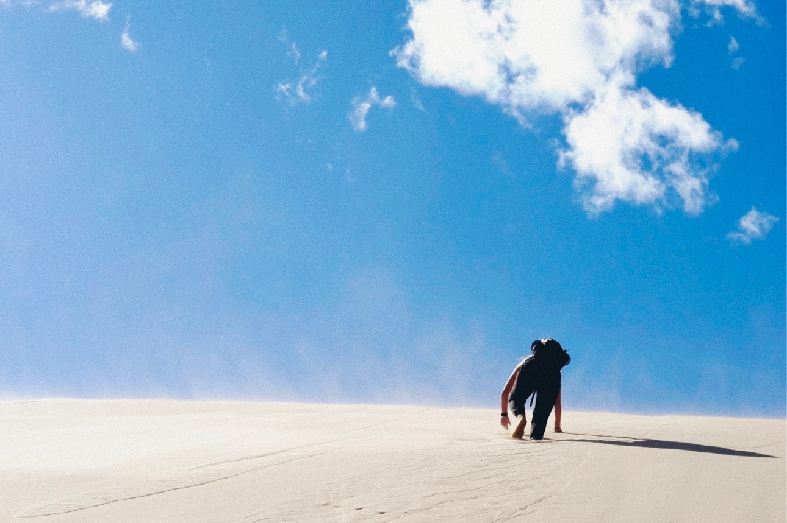
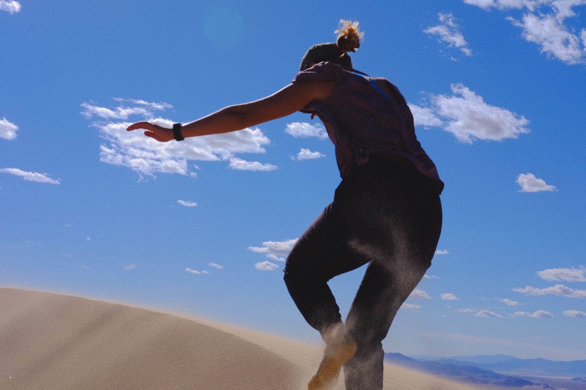
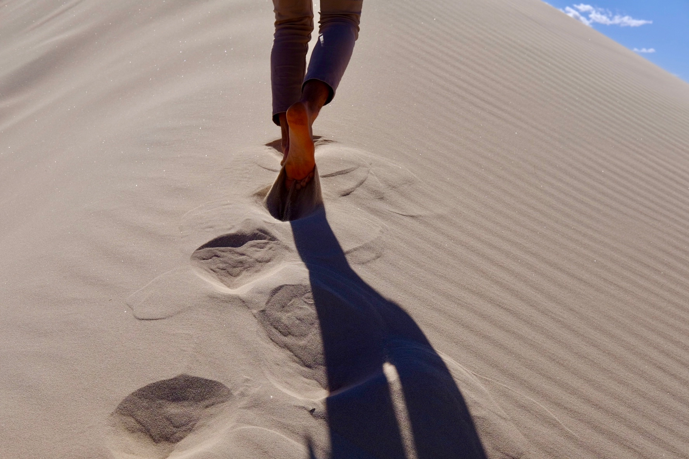
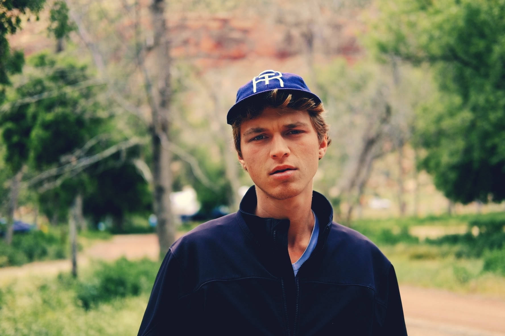
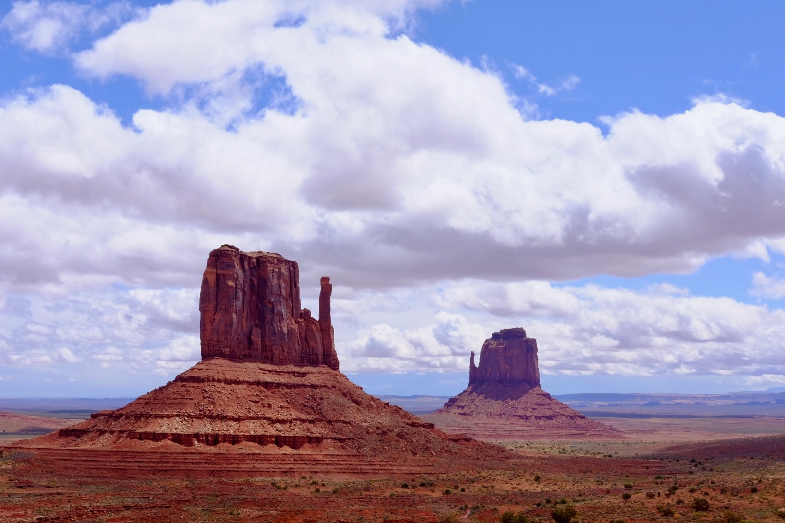
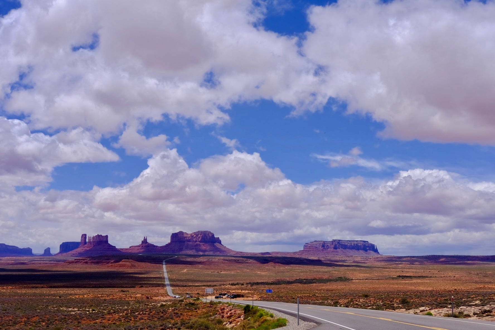
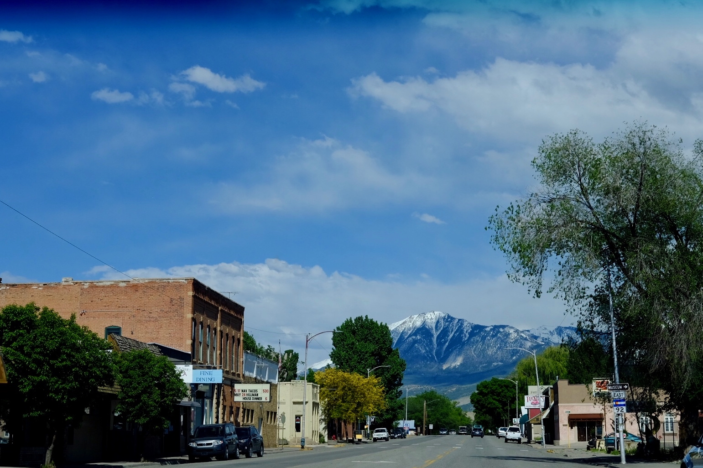
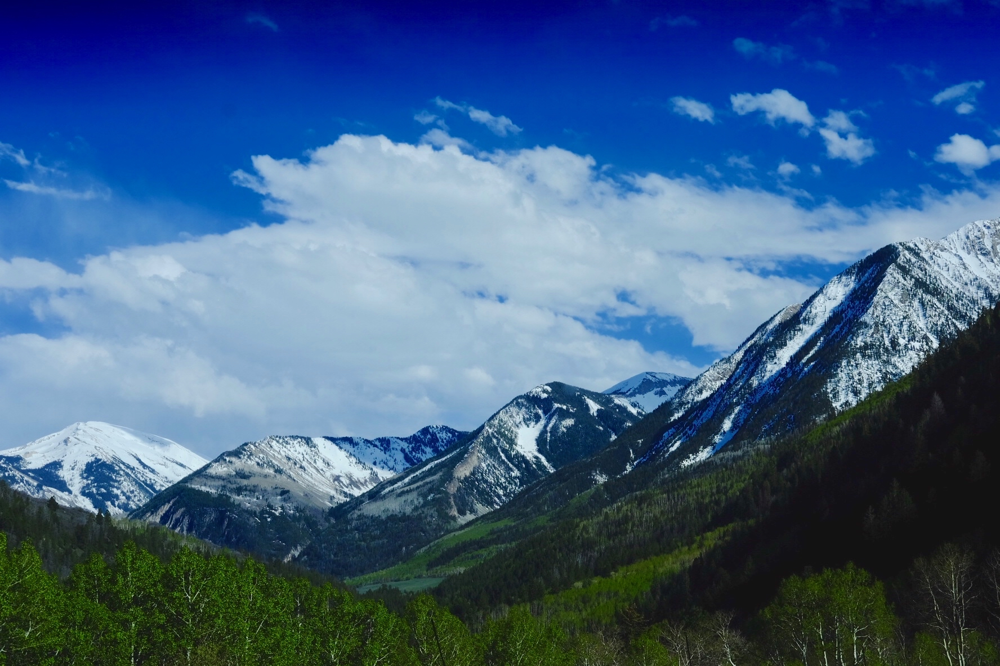
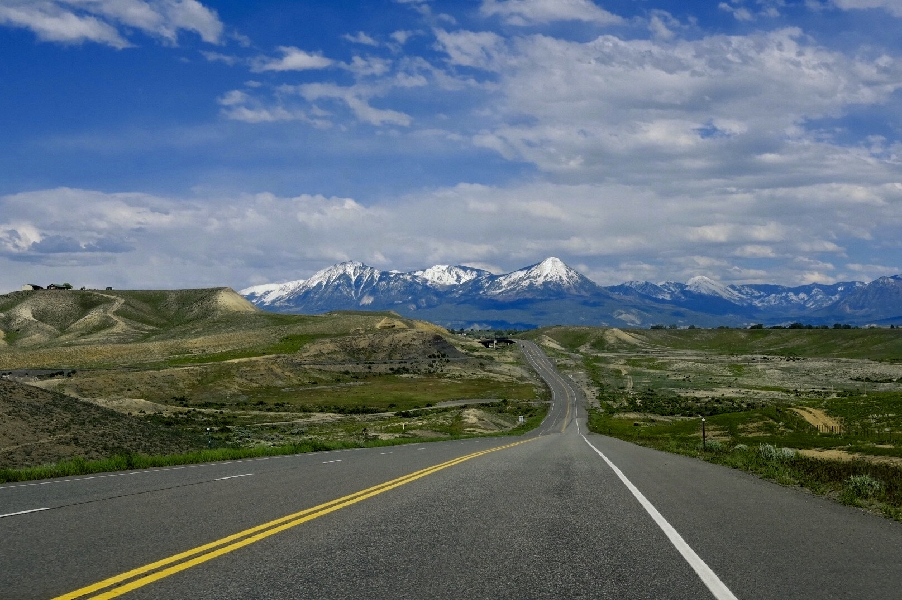

---
template:
- writing

title: Road Trip Reflections
date: 2019-07-17
city: Nine States
country: USA
description: >-
  I never thought I'd be one to fall in love with the road. But going to college in Los Angeles provided me the perfect excuse to criss-cross the country many times over the past four years. This May, leaving the morning after graduation, I was able to do the route one final time.
tags:
  - Travel
  - Photography
  - Road Trip
---

## **Sand**

### Kelso Dunes, California

I prefer to leave Los Angeles going East. West there are only islands. Most people leave through the air. I favor the sand. "Coming or going?" is a perennial traveler's questions. On the 210, you can do both. The view going in each direction is stunning, either rising out of or dropping into the flat, hazy basin that is the Inland Empire. This time, of course, my sister and I were going.

A train weaves back and forth across the interstate, snaking behind Mount San Antonio, affectionately called "Baldy" for its barren 10,000 foot peak. Viewed at the opportune spots, the train looks like a miniature toy, a collectors edition set against the foothills of the towering San Gabriel range.

The strip malls dwindle, then disappear. The flora quickly descends. Lush green leaves—foisted high on trees back on campus--instead cling low to dusty shrubs, and eventually, vanish as well. Quicker than one realizes the train and yourself are all that venture through the mountain pass and into the warm and barren highlands.

Those mountains were the gates guarding my life in Southern California, behind which I spent four years crafting another world--one that felt almost entirely my own. Each crossing of the gate, then, became a referendum of sorts. A constant point of departure, by which my own alterations could be revealed and measured. I was departing for the final time.

So my sister and I's conversation as we sped out into the Mojave desert was inevitably going to be heady.

## **Stone**

### Zion National Park, Utah

## **Sky**

### Monument Valley, Utah

## **Snow**

### Carbondale, Colorado

