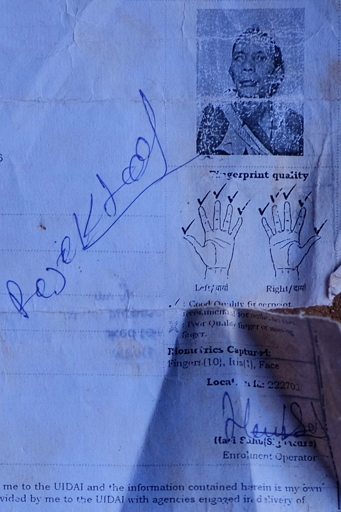

---
template:
  - writing
  - photography

title: Motorcycle Diaries
date: 2019-09-19
city: Ambikapur
country: India
description: >-
  Recently, I have been traversing rural Surguja on motorcycle with Vipul Paikra, a local tribal rights activist. We've been riding deep into the forest to speak with people who are not receiving their constitutionally guaranteed entitlements because of Aadhaar. Their stories have both complicated my thinking and challenged my convictions.

tags:
  - Digital India
  - Field Work
  - Agrarian Society
  - Biometrics
  - Civil Society
---

import Citation from "../../src/components/citation"

## A Dangerous Fantasy

The Indian countryside—at least in the Surguja district of Chhattisgarh—is breathtaking. It is a dense green, not unlike Alabama, only slightly more tropical. Replace pine trees with rice paddies, and everything else is the same. It's hot and mosquitos reign supreme. The roads alternate between gravel, punctured with potholes like Swiss cheese, and brand new highways, as straight and smooth as an airport tarmac.

The terracing of the rice paddies really does make for postcard-like views. I look out over the different levels and spot women carrying baskets on top of their heads. They are easy to spot. Their red, blue, and orange saris contrast the background so vividly, and their golden jewelry—bangles, necklaces, earrings—shimmer in the late afternoon sun.

It was hard to not romanticize the entire situation. Speeding down bucolic country roads at 80 kilometers per hour, hanging off the back of Vipul's motorcycle, I began to think that living out one's days in the Indian countryside might not be so bad. Life seemed easier—or if not easy, at least simpler.

  But this, of course, is a dangerous fantasy. I had found my way to the Surguja
  countryside exclusively due to the skill and patience of Vipul Paikra, a local
  land rights activist.{" "}
  <Citation
    link="https://www.epw.in/journal/2017/50/special-articles/aadhaar-and-food-security-jharkhand.html"
    author="Reetika Khera"
    publication="Economic and Political Weekly"
    headline="Pain Without Gain: Aadhaar and Food Security in Jharkhand"
    directQuote="Based on a recent household survey, this paper examines various issues related to this measure, including exclusion problems, transaction costs, and its impact on corruption. The findings raise serious questions about the appropriateness of this technology for rural Jharkhand."
  >
    I had been put in touch Vipul by Professor Reetika Kera, an Indian
    development economist known, in part, for her work on the digitization of
    entitlement programs, namely the Public Distribution Center (PDS), which
    provides grain rations to poor Indian families.
  </Citation>

Today we were going to visit members of some of India's "Scheduled Tribes," or indigenous groups recognized by the government to be historically disadvantaged. In fact, two of the three groups in the area, the Pahari Korwa and Pando, are designated "Particularly Vulnerable" because their populations have dwindled so low. These people's lives were under siege; they were not a fantasy.

But I couldn't keep myself from repeating "It's so beautiful" under my breath as we rounded each turn, the sun setting between the softly swaying tall grasses.

"Would you like to live here?" Vipul asked. I had spoken too loudly.

I don't think it was a rhetorical question, but there was a note of skepticism in his voice. Vipul is indigenous himself, part of the Kanwar Tribe. He grew up on forest land until he was 10 years old.

"I'm not sure. I mean—probably not," I fumbled over my response, "Life seems really hard." I instantly became self-aware, worried I would offend no matter how I proceeded. If I said how wonderful everything seemed, he might think I was fetishizing these group's way of life and willfully ignoring their struggle. But the opposite might be worse. If instead, I just offered patronizing condolences, he may feel I was reducing an entire people to nothing more than "poverty porn." Luckily, Vipul didn't push the issue.

## The Sarpanch's Task

 

  We spent the day tracking down four individuals whose names we received from
  the sarpanch, Dinesh Tirkey.{" "}
  <Citation
    link="https://panchayat.gov.in/"
    noAuthor
    publication="Government of India"
    headline="Ministry of Panchayati Raj"
    directQuote="The word raj means rule and panchayat means assembly (ayat) of five (panch). Traditionally panchayats consisted of wise and respected elders chosen and accepted by the local community. However, there were varying forms of such assemblies. Traditionally, these assemblies settled disputes between individuals and between villages."
  >
    A sarpanch is the elected official of the panchayat, the local system of
    self-governance throughout rural India and the broader subcontinent.
  </Citation>{" "}
  This particular panchayat was for the township Remhla.

 

  Tirkey gave us these four names because each person had persistent issues
  obtaining their entitlements: two individuals were blind, one had mortgaged
  their ration card, and one simply had not been heard from in months. Tirkey
  suggested we could talk to them and register their complaints to a higher
  authority. This is part of Vipul's job—collecting people's complaints and then
  pressuring the government to do something about it.{" "}
  <Citation
    link="http://www.pacsindia.org/partners/partners-in-chhattisgarh/chaupal"
    noAuthor
    publication="Poorest Areas Civil Society (PACS)"
    headline="Our Partners: Chaupal"
    directQuote="Chaupal are working in 660 villages in the Koriya, Surajpur and Surguja districts of Chhattisgarh to enable those from Scheduled Tribes (STs), Scheduled Castes (SCs), women and people with disabilities to access their employment rights and nutritional entitlements."
  >
    He is part of the civil society group Chaupal, which operates across
    Northern Chhattisgarh.
  </Citation>

With our four names jotted in my notebook, we sped off in no particular direction at all.

"What's the plan?" I asked Vipul.

"We'll just ask until we find them," he responded.

  So ensued our day of criss-crossing Remhla in search of these fated four
  names. We found numerous empty houses, retraced our steps at least twice, and
  began asking for directions from anyone who crossed our path. By 4:00 PM,
  after having spent most of the day on the road, we had found no one. It was
  just us and the rice fields, safe for the occasional cattle herder or bicycle
  salesman.{" "}
  <Citation
    link="https://youtu.be/J1cDECkN2xg?t=118"
    author="Denis Hopper"
    publication="Easy Rider"
    headline="Born to Be Wild"
    directQuote="It takes more than going down to the video store and renting Easy Rider to be a rebel."
  >
    I once again began entertaining my motorcycle fantasies. Vipul and Eli,
    replacing Peter Fonda and Dennis Hopper in the Indian version of{" "}
    <i>Easy Rider</i>, crossing the open country.
  </Citation>

On the side, we'd track down elderly, blind women who had been wronged by the state, and then bust up the small-town government crooks who took advantage of them. This, of course, is ridiculous, and definitely "white savior-complex-y," and surely problematic in most other ways, but I still decided to ask Vipul—who knows three times as many American films as I do—if he saw the relation.

"_Easy Rider_? I haven't heard of it."

## Finding Maniyaro

As afternoon stretched into dusk, I began to lose hope of finding anyone. Vipul decided to try one last house. If no one was there, we'd make our way back home to Ambikapur.

We biked maybe a kilometer up a small dirt road to find a group of women and kids congregated on the side. We asked if Maniyaro, one of the blind women, lived nearby. Yes, they exclaimed! In fact, she's coming this way now.

Vipul explained what we were doing, and the group began buzzing with anticipation. At that very moment Maniyaro rounded the corner, and the group surrounded her, everyone talking at once. She had to talk over everyone to make her case. Vipul's eyes widened with every sentence.

"She doesn't have Aadhaar. She was rejected!" he began translating. This was definitely out of place. There are plenty of people whose fingerprints or irises don't scan, and UIDAI (the Aadhaar-issuing government agency) has well-established exemption protocols.

"She says that without it, she can't get her pension, her ration, or even open a bank account!" This was even more alarming. Since 2018, the Supreme Court of India ruled that private firms such as banks cannot force people to have Aadhaar to use their services.

Vipul asked for my phone and began filming Maniyaro, peppering her with questions. What is your name? How old are you? Where are you from? When did you last try to register?

"Typically it's best not to start with questions," he'd admit to me afterwards, "but I had no choice. Her case did not make any sense to me."

She walked to her house and returned with her election ID card, but that was no use to us. Aadhaar and election ID's are still separate systems in Chhattisgarh; one has no bearing on the other. So we went to her house ourselves. She pulled out a tin ammunition box filled with fading and tattered papers. She began rifling through them, discarding sheet after sheet onto the dirt floor. We could tell she was becoming more agitated, until nearly the whole box had been emptied and she was quivering with anger.

"She's illiterate," Vipul voiced his sudden realization aloud.

We rushed to her side and began looking through the discarded papers. Sure enough, there was an Aadhaar application form. They had scanned her ten fingerprints, her face, and her one functional eye, but written on the back in blue pen was "Rejected." I asked Vipul why, but he said she didn't know.

We agreed to take images to the dealer where she was rejected, but we tried not to over-promise. We really had no clue what had gone wrong.

## Forced To Catch Up With Time

At one point late in the day, frustrated by yet another empty house, Vipul, typically a man of few words launched into his own assessment of the situation.

"It's like they are forced to catch up with time," Vipul said. I wonder if he meant the phrase "the times," but his own phrasing struck me instantly. I asked him to continue his thought.

Forcing people to constantly maintain all these documents, provide their biometrics, and use all this new technology—he called it a "forced imposition," but then qualified, "for better or worse." He must still think I'm in the pro-tech camp, because I have never heard of a "better forced imposition."

> Forced to catch up with time...

I began to mull the words over as we drove back into the city. I envisioned a scene where one person has some physical manifestation of, _time_, and they've taken it, and put it in some kind of vehicle—maybe a train, then a car, then a plane, or a hyperloop. And then you have another person, in this case, Maniyaro. And some one has come to her home, and told her that _time_ has left—and so she must as well.

> "It's amazing that people are catching up so fast," Vipul continues.

It's true. Look at Maniyaro. She's ready. She's packed her papers—she knows that they'll ask for them wherever she is being told to go. She never asked to leave, but she prepares all the same.

> "But maybe they have no other method," he finishes his train of thought.

A sobering ending, but I think he's correct. When _time_ departs, it matters little whether or not we want to follow.

We thank Maniyaro and her family, but even before we've finished taking our notes, most of the family has moved on to the day's more pressing tasks. Her daughter has left with the children. Her son takes some spare wire and begins climbing up the lone electrical pole outside the house.

"What is he doing," I ask Vipul as we walk back to the motorcycle.

"He's taking power."

"That's the government grid?"

"Yes."

"So aren't they already connected?"

"Yes, but only for one bulb."

I guess when the government takes _time_ and ships it off to who knows where, you might as well climb tall with your wire and siphon off a little _power_ for yourself.
