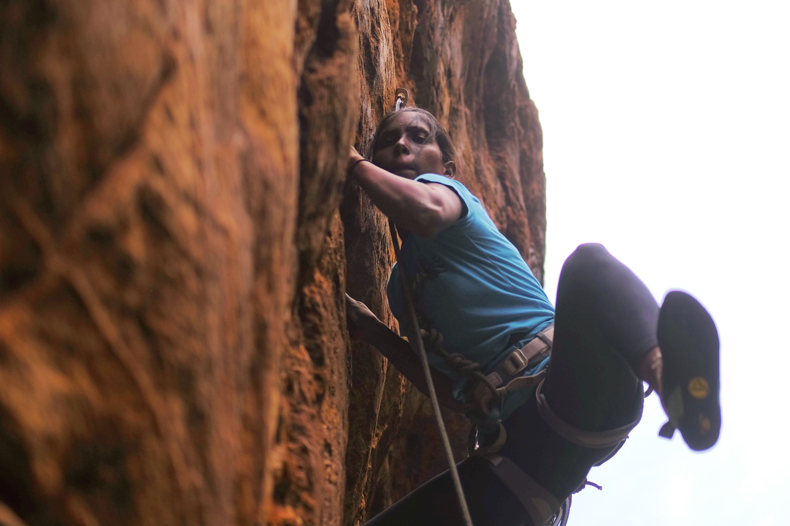

import Citation from "../../src/components/citation"

## Getting There

There is something almost cinematic about trains—especially the trains that crisscross India. On the South Western Railway's trip from Bangalore to Badami, everything is constructed of wrought iron, coated in off-beige paint that is chipping healthily. Massive bolts punctuate the walls and ceiling, giving the train an industrial texture worthy of its massive, churning diesel engine. Chain-link straps hang from the ceiling, covered in a wonderful and gaudy red-faux leather.

I walk down the corridor, passing sets of women in colorful saris settling in to sleep next to women in black hjiabs. With roti, men scoop up fragrant masalas and chutneys they brought from home. The less resourceful pick at bland biriyani peddled by staff who walk up and down the isle. I am one of these less fortunate.

Between each compartment there are wash rooms and dirty sinks, but this one has soap that smells like tea leaves. My climbing companions tell me this is a rare luxury. Between compartments is also where you can open the door and lean your face out, the Indian countryside rushing by. It's getting dark and the air is cool because the rain from the past two days has puddled on the ground.

Back inside, the hanging beds are so close together that moving about requires navigating a sea of feet and elbows. Nestle into your tucked away bunk near the ceiling, however, and each compartment expands into its own self-contained world—replete with an eager cast of characters.

Across from us, there are two beds parallel to the long corridor. A young couple shares a light meal on the lower bunk. They talk in soft banter, rarely breaking eye contact except to watch the occasional video on his phone. Before too long, she climbs up and the two go to sleep.

Some characters only make brief appearances, like the ticket counter or water bottle seller. A crying baby or boisterous group elsewhere on the train sets the scene in another compartment, prompting the imagination of another world. But the low drone of the passing landscape and the steady rumble of axel and track have a tranquilizing effect. Our 10x10 compartment is the only world I care to inhabit as I gently rock to sleep.

## Sensei

In terms of my climbing, this trip was hardly my finest. I have no real excuse. The objective of climbing is painfully simple (go up) and the quality of the routes in Badami were equal to and even better than many of the locations I have climbed in the U.S. But due to the novelty of the situation, my lack of familiarity with the group, and my lackluster training regime over the past year, I knew I would not be in top climbing form.

This problem was compounded on the first day. On my fourth climb of the trip, I got nervous while attempting to clip my rope to a quickdraw (for those not acquainted with climbing, this is one of the few moments where climbers are actually putting themselves at risk). I took a fall larger than I would have preferred.

I was unscathed—not even a scratch—but mentally, I was rattled. My belayer, Shwetank, could see it in my eyes as I came down from the route. I did not climb for the next few hours. I was humiliated. To be amongst new friends with the opportunity of a lifetime (how many get to travel across the globe to climb?), and yet, I was so timid, all I could do was sit and watch.

Luckily, Shwetank not only gracefully handled my fall, but coaxed me through the remainder of the trip. Our de facto leader, Shwetank was a 35-year-old menswear designer with a full beard and perfectly round glasses. Shwetank had rock-solid technique and an enviable dedication to fitness; so much so that Nassim, a jocular Moroccan-born Frenchman, gave him the nickname "Sensei."

Seemingly on the hour, Sensei would shout across the climbing area "Eliii!"

"What are you climbing?" he would insist more so than ask.

"I am resting," I'd usually respond.

"Why."

"Because I am tired!"

"Why!" Always a staccato beat, unwavering, spoken with the Indian trademark "v" sound—"vwigh!"

<Citation
  link="https://constantrenewal.com/toyota-method/"
  publication="Constant Renewal"
  noAuthor
  headline="The Toyota Method: A Shortcut For Identifying And Solving Your Problems"
  directQuote="Observe the production floor without preconceptions, Toyota would advise. Ask ‘why’ five times about every matter."
>
  Just like the Toyota Method, his questions cut to the heart of the matter at
  hand, revealing the banality of any excuse I would try to muster.
</Citation>

"Are you feeling lazy?" he asked on the second day. It didn't take five "Why's" to get to the bottom of this mystery. I was, quite simply, just being lazy. After even more chiding, Shwetank and others convinced me I needed to get on a problem called "Never Hang." Thankfully, I do not understand the grading system here in India. I am used to something called the Yosemite Decimal System, which runs from 5.1 to 5.15d. Outside at home, I typically climb in the 5.10's. Here in India they use the French system, which runs from 2 to 9C. The conversions are not necessarily intuitive.

I tied into "Never Hang" without asking for anyone to make the translation for me. "You can do it," they assured me, and that was all I needed to know. Getting on a climb without expectations is a completely different feeling than working on a problem again and again. Each time I threw my hand for the next hold, I had no idea whether or not I would be able to hold on. There's no self-doubt that came from having fallen time and time again. The unknowns were truly unknown.

To begin, I stepped on a tiny chip in the rock and threw my right hand far above my head, reaching up to a ledge I could not see. My hand stuck; better yet, it felt steady, as if you could put a hundred pound weight around my waist and I still would not fall.

I stepped high and wide with my left foot, positioning it so that my hips were splayed as far as they could stretch. It too stuck, and I was thoroughly surprised by how stable I felt. I could hear the group begin to congregate behind me, giving encouraging shouts as I moved to each new hold. Their voices soon faded, however, even though they were shouting louder and louder. My brain was shutting down as a wash of intuition began to sweep back and forth which each movement.

I began to reach arm and leg in a simple rhythm, connecting each fluid motion by rotating my hips. I knew I didn't have time to rest. I could feel the hand holds become smaller and smaller as I rose up the wall. But I was in complete "flow" by this point. I had no consciousness left to process fear of falling. Instead I began to move even quicker, to further preserve energy. I think I finished the 100 foot climb in less than a minute.

Putting my had on the anchor at the top, I could feel Shwetank tighten my belay, and I sat back in my harness. Emerging from a near trance, the riotous shouts of my friends below once again became audible. I took in the scene from the the top and was lowered back to the ground. United with my friends again, they told me that I had flashed a 5.11a, the hardest climb I have ever attempted outside.

## What Country?

On our second day, we were walking up to one section of the rock called "Temple Area," named after the still utilized shrine at the top of the walkway. The path was paved in parts, and connected directly to the town's main road. As we ascended, we passed the home of Ganesha, the local legend and keeper of the climbing community in Badami. Further up the path, a local herder hissing at his unruly pack of goats quickly overtook us.

At one point, a group of girls in school uniforms came up to us, laughing bashfully and tugging at the backs of their skirts. Shwetank spoke to them and stopped to take their photo. They gladly posed. Then they shouted, "What country?" as we kept taking slow steps up the path.

"India, child," Shalaka chastised one of the girls with a soft tone. They kept looking expectantly at me, and I replied, "USA."

"My country is Badami!" Bharath said to himself more than anyone else, inconcealable pride welling in his voice.

