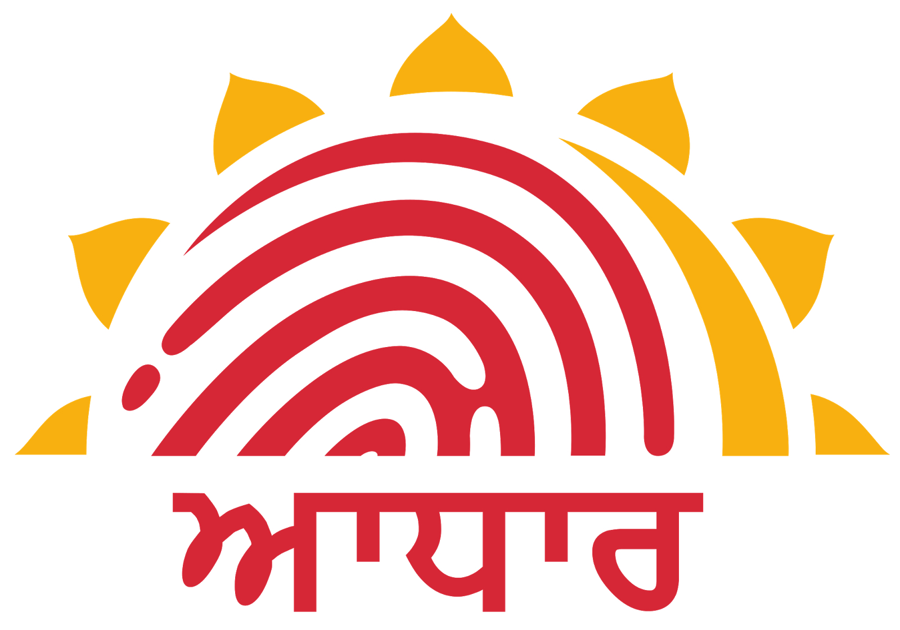
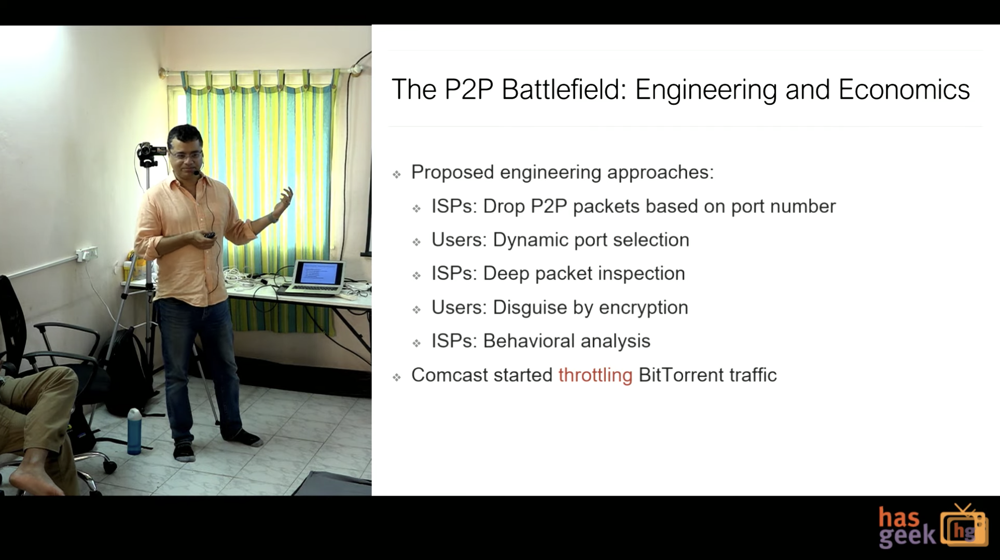
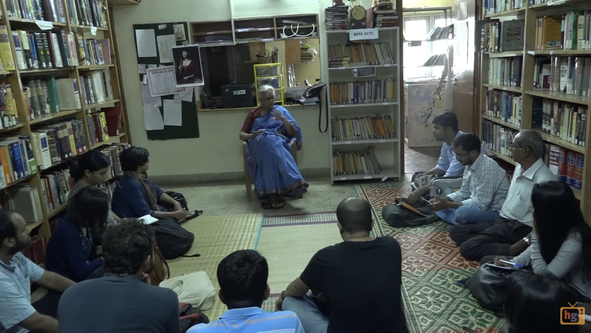
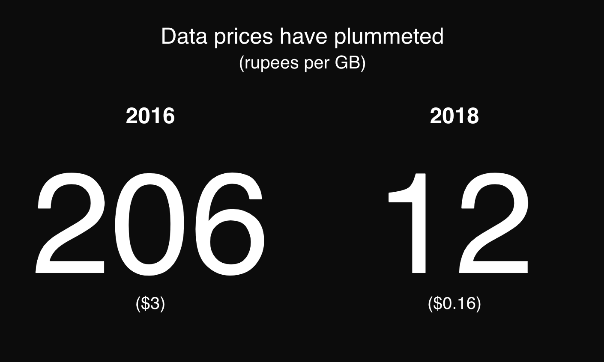

import Citation from "../../src/components/citation"

## What It Is

Aadhaar is India's Social Security number, kind of. There are two main differences. First, Social Security is almost 85 years old; Aadhaar is 10. Second, Social Security is, by definition, a social insurance program which has over time morphed into the "de facto" national ID. Aadhaar, though initially an opt-in program, has now become mandatory for just about everything.

  Here's a non-exhaustive list: bank accounts, tax filings, food rations, crop
  subsidies, college scholarships, mobile SIM cards, train tickets, and school
  meal programs. The national government uses Aadhaar, the state governments do,
  private companies (even though it is not clear if they are supposed to),{" "}
  <Citation
    link="https://www.livemint.com/companies/news/social-media-accounts-need-to-be-linked-with-aadhaar-to-check-fake-news-sc-told-1566217179666.html"
    noAuthor
    publication="Mint"
    headline="Social Media Accounts Need to be Linked With Aadhaar to Check Fake News, SC told"
    directQuote="Social media profiles of users need to be linked with Aadhaar numbers to check circulation of fake, defamatory and pornographic content as also anti-national and terror material, the Supreme Court was told on Monday."
  >
    and now even transnational firms are being asked to verify their Indian
    users with Aadhaar.
  </Citation>

 

Simply put by internet privacy advocate Kiran Jonnalagadda in 2017, "Aadhaar has become a hammer in the hands of central government that makes every problem look like a nail." Despite legal challenges all the way up to the Supreme Court of India, that sentiment remains true today. The aggressive expansion has worked.{" "}

<Citation
  noQuote
  link="https://www.thehindu.com/business/Aadhaar-covers-99-of-adults-in-India-Prasad/article17104609.ece"
  noAuthor
  publication="The Hindu"
  headline="Aadhaar Covers 99% of Adults in India: Prasad"
  directQuote="Social media profiles of users need to be linked with Aadhaar numbers to check circulation of fake, defamatory and pornographic content as also anti-national and terror material, the Supreme Court was told on Monday."
>
  According to the national government, 99% of Indian adults have enrolled in
  the Aadhaar program.
</Citation>

The sheer scale and speed of Aadhaar's ascendence is impressive, but as with any change so broad and rapid, controversy soon follows. Over the past decade, the program has captured the country's political consciousness precisely because it encapsulates such promise and peril at the same time. The word Aadhaar means "foundation" in Hindi, which perhaps makes sense. Replacing the foundation always make waves.

The premise of Aadhaar is to centralize government systems and "uniqueify" each individual user. Its architects hope streamlining bloated bureaucracy and removing duplicate users will improve efficiency and reduce corruption. Similar approaches are being taken with the Indian economy. One example is the Unified Payment Interface (UPI), a sophisticated system of digital payment protocols, which has enabled a cashless economy here in India that is years ahead of the United States.

Then, on the other hand, Aadhaar has been ravaged by data management that has been called careless and even deceitful. The government claims that the central repository of unique IDs has never been breached, and semantically, this is true. There is no documented case of anyone accessing or altering the underlying biometric information.

When evaluating third-party access to the data, however, arguing that the system hasn't been compromised requires more tortured logic.{" "}

<Citation
  link="https://www.zdnet.com/article/another-data-leak-hits-india-aadhaar-biometric-database/"
  author="Zack Whittaker"
  publication="ZDNet"
  headline="A New Data Leak Hits Aadhaar, India's National ID Database"
  directQuote="A data leak on a system run by a state-owned utility company Indane allowed anyone to download private information on all Aadhaar holders, exposing their names, their unique 12-digit identity numbers, and information about services they are connected to, such as their bank details and other private information."
>
  There exists a laundry list of investigative and academic reports from across
  the country that show vulnerabilities in the larger Aadhaar ecosystem. The
  most damning claim that the demographic data of almost every user has been
  exposed in some capacity.
</Citation>

Aadhaar is the archetype of technology as a "double-edged sword." Similar to how social media was utilized by both democratic activists in Tunis and white supremacists in Charlottesville, or how nuclear fission is both carbon neutral and heralded the age of "mutually assured destruction." Aadhaar is a tool, which restructures the capabilities of those who use it. Labeling it merely "good" or "bad" is missing the point. Over the coming months, I hope to better understand how all actors—the government, private companies, urbanites, indigenous groups, to name a few—use the technology (or have the tech used on them).

## How It Came To Be

 

  Kiran Jonnalagadda is, in fact, one of the better people to preface the Aadhaar story.{" "}
  <Citation
    noQuote
    link="https://medium.com/karana/a-rant-on-aadhaar-6213e002f064"
    author="Kiran Jonnalagadda"
    publication="Kaarana"
    headline="A Rant on Aadhaar"
  >
    I learned about Jonnalagadda after I read his famed Medium post "A Rant on Aadhaar."
  </Citation>

It is full of gems such as:

> You may be composed of flesh and blood, but Aadhaar is an electronic system that only receives bits over the wire. A fingerprint scanner turns fingers into bits—bits that can be copied and replayed any number of times, for the rest of your life, and there’s absolutely nothing you can do to stop it.

Jonnalagadda's "rant" comes off more like teatime pleasantries, starting his "tirades" with "I do not doubt their sincerity or integrity." He's similar in real life—earnest, if a touch removed.

<Citation
    link="https://medium.com/karana/aadhaars-implicit-patriarchy-a01689a755ba"
    author="Kiran Jonnalagadda"
    publication="Kaarana"
    headline="Aadhaar's Implicit Patriarchy"
    directQuote="Husband as ‘master’ and wife as simply a ‘woman’. Even the Hindi words pati and patni have the same original meanings. The term Rashtrapati for the President literally means ‘husband of the nation’. When Pratibha Patil became India’s first female President, many argued her title should remain Rashtrapati."
  >
    I met with Jonnalagadda last week, and he did seem as comfortable discussing
    the patriarchal roots of Hindi etymology
  </Citation>{" "}
  <Citation
    link="https://medium.com/karana/technology-doesnt-solve-problems-intent-does-65205c1c3e75"
    author="Kiran Jonnalagadda"
    publication="Kaarana"
    headline="Technology Doesn't Solve Problems, Intent Does"
    directQuote="Did Node.js give your front-end developers an automatic upgrade to back-end developer status? Nope, the language is just one piece of the puzzle."
  >
    as he would be with technical jargon like Node.js and V8 WebAssembly
    Engines.
  </Citation>{" "}That is not to say the conversation itself was entirely comfortable. Jonnalagadda takes "think before you speak" to a new level. When I finished a question, he often didn't respond. I did not count the length of these silences, but they were long enough for me to wonder if I should.

 

  These pauses further convinced me that he never rants (typically defined) about
  much of anything. Instead, he recommended books. One,{" "}
  <Citation
    link="https://factordaily.com/profile-kiran-jonnalagadda-zainab-bawa-hasgeek/"
    publication="Oxford Univerisity Press"
    author="Tarangini Sriraman"
    headline="In Pursuit of Proof: A History of Identification Documents in India"
    noQuote
  >
    <i>In Pursuit of Proof</i>, is about how Indian's have constructed their identity for decades without digital tech.
  </Citation>{" "}
  In response, I offered him a talk given by one of my favorite academics, Jill
  Lepore, on the history of evidence.

 

  When we randomly bumped into each other at a book store a week later, he had
  already watched the talk and discussed it with his colleagues. "It works as a
  provocation... but this thesis is immensely weak (and Eurocentric to boot),"
  was one take. Jonnalagadda has made a profession of initiating discussions
  such as these. Since 2010, he and his wife, Zainab Bawa,{" "}
  <Citation
    link="https://factordaily.com/profile-kiran-jonnalagadda-zainab-bawa-hasgeek/"
    publication="Factor Daily"
    author="Shrabonti Bagchi"
    headline="Meet India’s geekiest couple: Kiran Jonnalagadda and Zainab Bawa"
    directQuote="But, Kiran and Zainab’s achievement and influence are far larger: they help synergise a scattered tech ecosystem without being involved in the business of tech themselves; they bring geeks and tech aficionados together and give them a non-competitive space to talk about things that excite them — the latest programming language or the newest app development platform — and they do this with rigour, efficiency and integrity."
  >
    have run HasGeek, a volunteer organization which "creates discussion spaces
    for geeks."
  </Citation>

Jonnalagadda and Bawa embody the technologist I aspire to be. Their technical chops are unassailable, and yet their personal aptitude with technology never translates into hubris about its promise. They know their stuff, _and_ they know to doubt what they know. They invite skepticism to their doorstep, encourage, and nurture it.

At first, Jonnalagadda spoke plaintively of Aadhaar, like one might of a family member fallen on hard times. Perhaps that was because he made Aadhaar before Aadhaar existed. It was here in Karnataka, in 2006, that Jonnalagadda helped start Project Nemmadi,{" "}

<Citation
  link="https://money.cnn.com/2009/07/08/smallbusiness/internet_for_india.fsb/index.htm"
  author="Malika Zouhali-Worrall"
  publication="CNN Money"
  headline="An Internet for Rural India"
  directQuote="Through a public-private partnership Comat would open hundreds of centers in the state's rural areas and digitize other records -- everything from birth certificates to pension documents -- at no charge."
>
  a public-private partnership between the state government and Comat
  Technologies.
</Citation>

Nemmadi means "peace of mind" in Kannada, the official language of Karnataka. The idea was simple: provide internet-enabled centers where local residents could obtain authorized copies of their identifying documents directly from the government. "We're democratizing information services" and "We're making government better," Comat's CEO Sriram Raghavan insisted at the time. By Jonnalagadda's estimation, the project failed. I asked him what had happened.

“The administrators, they got beaten up,” he said, “There were angry mobs. They got attacked.”

“Why?” Answering that was very simple and also futile.

Simply put, the system didn’t work. Comat has long been defunct. But who was to blame, Jonnalagadda explained, it was impossible to know. Determining _the singular_ mistake was impossible, and blaming one person alone would have been disingenuous. We talked a lot about mistakes, actually.

“We can’t afford to keep learning from our failures,” he said.

_“Can’t?”_ I had to clarify.

“Of course not. With each failure, some one is getting hurt.”

I paused a beat; the conversation had un-synced. "Learn from your mistakes" is the whole point, right? It's axiomatic, like "treat others as you want to be treated." Jonnalagadda agreed with my retort, but was already one step ahead. The problem was my premise.

Yes, constant learning is essential, but there are so many other ways to learn, most of which cause less harm in the process. "Just try _something_." "Fail fast!" "Repeat, repeat, repeat." Perhaps these methods create good food delivery apps, but Jonnalagadda preferred they weren't used for starving family's food rations.

At its core, he was saying something so simple, so utterly true, yet I—along with the Silicon Valley techno-optimists, the invincible Wall Street executives, and the "design thinking" evangelists all seem to have forgotten. Failure is good? Perhaps only when you're not the one cleaning up the mess.

<Citation
  link="https://yourstory.com/2016/07/india-stack/"
  author="Vishal Krishna"
  publication="YourStory"
  headline="India Stack - A Change Agent for Government, Startups and Corporates to Serve Citizens"
  directQuote="[Nilekani] adds that it was a product of several years of innovation starting with the UIDAI’s Aadhaar platform. “This is India’s single most important innovation to formalize India’s domestic economy through digital services,” he says."
> 
For all the buzz about the radical revolution of Aadhaar,
</Citation> I had found some one who had done it years earlier. To this day, he seems to be asking for something very modest, "Learn from my mistakes." I am not sure who is listening.

## Where It's Going

 

  Aadhaar raises fascinating questions about what should be public and what
  should be private in our bold, new digital age.{" "}
  <Citation
    link="https://medium.com/karana/public-private-and-secret-information-f857f3931f6b"
    author="Kiran Jonnalagadda"
    publication="Kaarana"
    headline="Public, Private and Secret Information: Which type are biometrics?"
    directQuote="A good secret is disposable. If your password is compromised — you gave it away or someone guessed it — change your password. If you’ve lost your digital certificate, revoke it and get a new one. If your Aadhaar number leaks, UIDAI should give you a new one."
  >
    By linking one's digital self to supposedly immutable physical
    characteristics—fingerprints, iris scans, and face scans—Aadhaar is unlike
    previous paradigms of internet privacy.
  </Citation>

There is no way to "delete your account," unless your morning routine consists of filing down your fingers, putting in colored contacts, and donning a full face covering. It's a unidirectional system. Opting in happens almost automatically, and opting out is nearly impossible, which begs the question: Will India become the first country that requires a “digital self” to ensure a “political self?” Or, even further abstracted, what are the constitutive aspects of democratic citizenship in India today?

But before I predict the coming _Black Mirror_-styled apocalypse, I have to remind myself that most users do not spend their day philosophizing Aadhaar's implications for political autonomy. Did you do so when you logged into your iPhone to read this? It is the same technology.

For Indians--at least the tiny few I have talked to or read about--Aadhaar matters most when it doesn't work. In the beginning, this was perhaps likely. No such feat had ever been attempted, and the mere viability of the program was highly doubted. India's previous decade of digital advancement has quelled such concerns.

The above figure may be hard for Americans to interpret at first, but you did read that correctly. I pay 16 US _cents_ per gigabyte of data. Actually, it may be less. In the States, my family plan allocated 8 GB per month for $160. Here, I am allocated 90 GB per month, all for one pre-payment of $3. Why?

<Citation
  link="https://www.bloomberg.com/news/articles/2018-10-16/how-india-s-richest-man-shook-up-its-phone-industry-in-charts"
  author="Bhuma Shrivastava"
  publication="Bloomberg"
  headline="How India's Richest Man Shook Up Its Phone Industry, in Charts"
  directQuote="Consumers have been the clear winners, as the cost of sending and receiving data wirelessly has plummeted. The plunge in prices has led to surge in data traffic to 1.5 billion gigabytes a month last year... “Mobile data consumption is higher than USA & China put together.”"
>
  Because in 2016 India's richest man, Mukesh Ambani, CEO of Reliance Jio, decided he wanted India to
  lead the world in wireless connectivity.
</Citation> He went about this by giving away phones, literally. The first six months after launch, mobile data on Jio phones was completely free. Aadhaar was not required, but it was by far the most simple way to enroll. So much so, many still think—until recently, myself included—that Aadhaar was required, even though private companies are not allowed to compel Aadhaar by law.

 
 

  The pace of digital innovation in India is truly staggering. The relative lack
  of regulation considered next to the United States or China has led many
  transnational companies to jump into the fray,{" "}
  <Citation
    link="https://edition.cnn.com/interactive/2018/11/business/internet-usage-india-future/"
    author="Rishi Iyengar"
    publication="CNN Business"
    headline="The Future of the Internet is Indian"
    directQuote="That heady mix of huge investment and rapid growth has turned India into a laboratory, spinning out ideas and products that will shape the internet way beyond India's borders."
  >
    testing new features and rolling out new products in India before anywhere
    else.
  </Citation>{" "}
  "Designing for the next billion users" and "If it works in India, it will be
  the global standard" are common refrains.

The energy is infectious, and the future looks bright. Unfortunately, such momentum further alienates those who choose not--or more importantly, cannot--get on board. These are the "edge cases," those system malfunctions that "occur only at an extreme operating parameter." In India, there are many such parameters: caste, socioeconomics, urbanization, just to name a few.

<iframe
  width="560"
  height="315"
  src="https://www.youtube-nocookie.com/embed/JZ3ykvOVnMQ?controls=0"
  frameborder="0"
  allow="accelerometer; autoplay; encrypted-media; gyroscope; picture-in-picture"
  allowfullscreen
></iframe>

<figcaption>
  Source: People's Archive of Rural India - Pramod Kumar, a day laborer who's
  wages went missing after the government required his subsidies to be routed
  through Aadhaar.
</figcaption>

In my computer science courses during college, the edge cases were always the final thought. First we documented what we were going to do, then we built something that achieved the minimal objective, then we optimized, and only then, did we go hunting for the edge cases. Perhaps this is because edge cases seem to abide by the law of diminishing returns. Ensuring an algorithm works 99 percent of the time may take a day; the next 0.9 percent make take a week; the next 0.09 percent could be years. Nothing was foolproof, and determining "good enough" was a necessary matter of subjective judgement.

Nandan Nilekani, the creator of Aadhaar, understood this from the beginning.

> “Internet systems have shown scale. The difference was, our system had to have the robustness and reliability of an enterprise system. In an Internet application, if an e-mail doesn’t go, it’s not the end of the world. But this was like a credit-card system. You can’t afford to lose transactions.”

That was 2011. Today Aadhaar is even more vital than credit cards. A lost transaction may be a lost college scholarship, a lost childcare benefit, or a lost food ration: the kinds of things that can change--or even end--a life.

I cannot predict where Aadhaar will go, and after all, to invoke Jill Lepore once more, "prophecy is a mug’s game." I will, however, offer a criteria--one that anyone who claims to build the future should consider. Instead of trying to capitalize on what _might_ happen, I'll heed Kiran Jonnalagadda's advice, and offer a means by which we can _learn_ from what _actually_ does end up happening.

Stop worrying about scale. Stop worrying about speed. Let's ask ourselves: does the world need to be any more imposing and chaotic than it already is? Instead, we should judge our success by how we handle our edge cases. I want us to go the margins and see. In the next decade, let's problem-solve for the outliers rather than view outliers as the problem to be solved.
