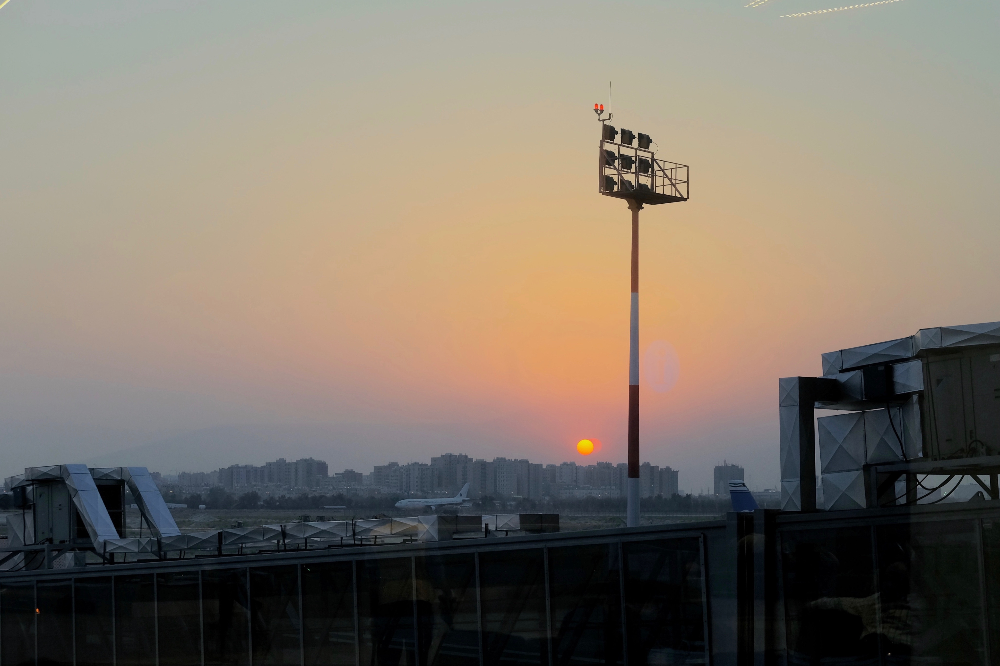

---
template:
- writing

title: "Week 1: Whirlwind"
date: 2019-08-03
city: Bangalore
country: India

description: "I am writing this almost exactly one week after I left home, and I feel like I've lived a miniature lifetime. From Birmingham to New York, to the Kuwait Airport, and finally to Bangalore, I honestly am having a hard time conveying the quantity, range, and complexity of the first week of this journey."
tags:
  - Digital India
  - SIM Cards
  - Airports
---

## Kuwait Airport

I flew out of JFK after spending an _incredible_ weekend traversing the New York art and music scene. One genre-bending exhibit, _Vessel Orchestra_ by Oliver Beer, even combined the two. It was astounding enough to inspire its own (forthcoming) post.

The first leg of my flight landed me in Kuwait, where I would wait for the next seven hours. Here I had my first "small world" moment. I was looking around the modest but spotless terminal, somewhat impressed that I had _already_ begun to feel out of place, when I noticed the person sitting back-to-back with me was rapidly flipping through powerpoint slides that contained a) lots of English and b) even more math. As stupid as this may sound, I thought to myself, "He does English _and_ numbers, this could be a good chat."

"What are you reading there?" I asked. "Large scale computational simulations for a new generation fusion reactor," he replied. He saw my eyes widen, laughed, and told me he had to file a report in the next 15 minutes. Turning back around, he added, "But I'd love to talk when I'm done." Two hours later, we had covered a lot of ground: the divide between Pakistan and India, the divide between white and black America, rock climbing in Yosemite, the trade-offs of pursuing a PhD, just to name a few.

His name was Sami, and he was heading home to Islama, Pakistan after completing his first year of an Aerospace Engineering PhD at Rensselaer Polytechnic Institute. Having done undergrad at the University of Richmond, he was acquainted with the American South. We had visited the same national park in West Virginia. We both dreamed of climbing El Cap. We had both recently jumped the turnstile in the New York Metro.

By the time I had to board, I was honestly upset Sami was not en route to Bangalore like myself, but as he reminded me, he couldn't take the risk; too many horror stories of Pakistani's who tried to travel in India. It was a sobering reminder of the immense power of the American passport in my back pocket, and the implicit supremacy that backs it. The Watson subscribes to a "global commons" mentality, but it is no doubt powered by the trappings of American dominance.

## Landing in Bangalore

I landed in Bangalore at 3:45 am, approximately 26 hours after departing New York. After a small kerfuffle with the customs agent—my time in India may end up being halved (but likely not)—I collected my bags and was immediately hit with my first "digital world vs. physical world" collision. I had taken out my Verizon SIM in the US, paranoid they might sneak in a hidden fee for crossing borders with it. I had hoped to log onto the airport WiFi to hail an Uber to my friend Rhea's home. Much to my luck, the WiFi login required I submit my phone number; they'd text me a login PIN. I was in the dark.

This realization came very quickly: the digital tools which I chide in the US as mere luxury were now going to be essential unless I was prepared to _radically_ raise my tolerance for the unknown. This time, exhausted from days of flying and overwhelmed by the lack of familiarity, I didn't debate long. That SIM card popped right back in my phone, and I breathed an audible sigh of relief when the familiar "Ding!" told me my driver was coming to get me.

As I left the airport parking lot and headed south towards Bangalore, the first billboard I saw read as follows:

> **"Your phone knows a lot about you. But we don't."**
>
> Jio, Digital Life

I smirked. "It's like they knew I was coming." I had switched to a Jio SIM card less than 24 hours later. Little did I know, Reliance Jio, the parent company that made my SIM sits right at the heart of digital debates here in India.

## Jio SIM

My first three days in Bangalore have only been possible because of two incredible new friends, Rhea and Romanshi. Both recent graduates of California colleges like myself, they have been my eyes and ears in Bangalore, helping me get up to speed in hours in what otherwise could have taken me a week. I am living with Rhea's family—she's lending me her room actually—in a lush, green residential neighborhood called Sadashivanagar. Romanshi lives across the street, and has already introduced me to her mother and grandfather.

Romanshi even offered to help me get my new SIM Card. We were driven to the adjacent neighborhood of Malleshwaram, a far more populous and hectic area. Driving, or even just riding in, a car is not for the faint of heart. Everything is reversed, British style. Stoplights are few and far between. I have yet to see a stop sign. Lanes, when they do exist, are ignored, and sidewalks don't appear often either. It's mainly everyone—pedestrians, motorcycles, vehicles, _and_ livestock—fending for themselves.

The Jio store turned out to be a Jio umbrella cart, which honestly makes sense; SIM cards are not big, why waste the space? We walked up and quickly were told I would not be allowed to get a card. Why? I did not have an Aadhaar card. Quick refresher, Aadhaar is the biometric-based national ID program I had come to learn about. I didn't think my first lesson would be so personal. No Aadhaar, no phone. It was very simple.

However, before I could apologize to Romanshi for dragging us all the way out here, she whipped out her own Aadhaar card and the salesperson was tearing into the packaging on a brand new SIM. He even had to scan Romanshi's face with his phone to match it to her ID card. Directly after, he turned to me and asked for my phone. The irony was not lost on any of us.

"I feel like we've been tethered together for life," I told Romanshi. "Maybe," she smirked.

## Initial Thoughts

I think the best way to describe my current state is overwhelmed, but if you stripped the word of its negative connotation. I am not distressed; perception is just exceeding comprehension. Each hour brings a new challenge, and I oscillate accordingly.

I've eaten hands-down the best vegan food of my life and also completely forgotten entire mealtimes. I've already envisioned the moment I return home and at the same time am worried that there won't be enough time to do everything I want. I have been welcomed graciously by people who don't know me, and I've also already had to find new accommodations. Today, I move across town into a "co-living homestay"—Bangalore is very business savvy and is correspondingly into the latest business buzzwords. I think this place is just a glorified Aribnb. Time will tell.

I don't know much yet, but I will make one assertion: India moves fast, but my mind might be racing even faster.
