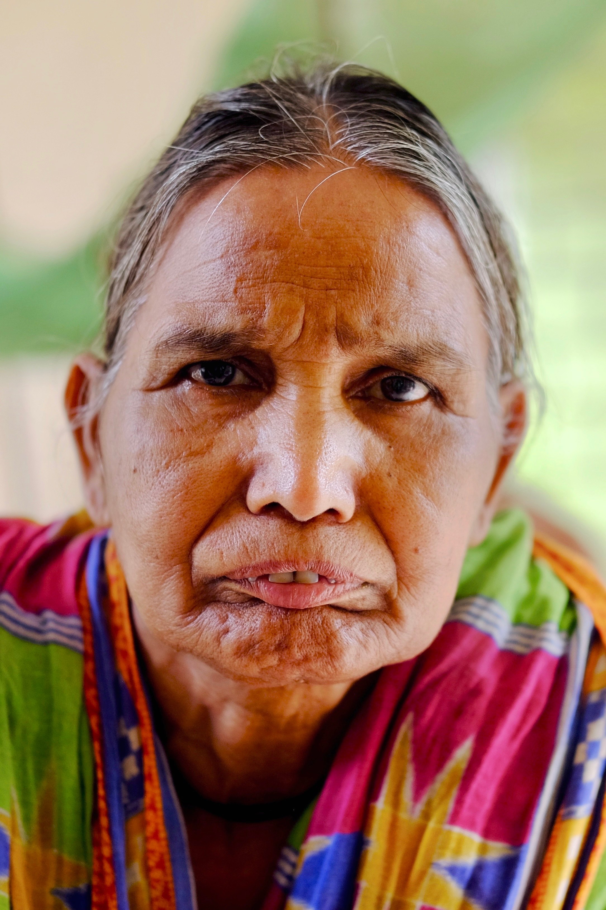

Kauwa Kunda is a small community on the outskirts of Raigarh in Northern Chhattisgarh. It is populated largely by people with leprosy. The community is on government land. There is an old age home for those lucky enough to gain admittance. But most residents live across the river, connected by only a single bridge, isolated in dismal conditions. Outcast from their homes, but unable to purchase the land they currently live on, they are forced into limbo--unrecognized by society and government alike.

## **The Old Age Home**

## Choeta Ram

Choeta Ram said he was over 70 years old, but he—like everyone we talked to—did not know his actual birthday. Notably, he was the only Raigarh native. He had been at the home for six years, ever since his wife died. When that happened, his son sold all his property and left for a new life in Bhopal, in the neighboring state of Madhya Pradesh. Choeta Ram said his son visits him on occasion but never sends money.

## Lakshmi Bai

Lakshmi Bai estimated she was over 80. She did not have leprosy, but had been cast out by her two sons and four daughters all the same. Her husband had been a _Patwari,_ a government accountant with the Revenue Department where they lived. As such, she should have been entitled to a "government family" pension when he died—which is far greater the standard retirement pension, itself only 5 USD a month. But she said that one of her sons burned all of her late husband's documents, and as a result, she gets nothing.

## Ukia Bai

Ukia Bai told us she was over 70 years old. She had come from the neighboring state of Orissa. This had caused interesting complications; for instance, she could not collect rations or pensions here in Chhattisgarh, but she could vote. She had been at the home for four years. When her husband died, she was the only person heading the house. No one would marry her daughter with her around, so Ukia left to give her daughter a chance at starting a family for herself.

## Koera Pradhan

Koera Pradhan estimated he was 85 years old, but he has only been at the home for the past five. He told us he learned of the home while begging in a train station in Uttar Pradesh, India's least developed state. He reckoned that he hadn't lived at home for over 50 years. He left because he was told having a father with leprosy would deprive his sons of their future. While asking him our standard set of questions: do you have Aadhaar, pension, ration, bank account, he interrupted—“When I've never had any money, why would I have a bank account?”

## **Kauwa Kunda**

## Prabhadevi

Prabhadevi has suffered a severe handicap for decades, according to the women who spoke to us on her behalf. It had severely limited her mobility. Despite this, she would still spend her days on the street, begging. Only recently, they said, had she slipped and broken her hip. She is now effectively paraplegic; she can no longer walk. She lives alone, but relies on the community to live. They help feed, clothe, and bathe her. Her only source of income now is a government pension of 350 rupees per month, or 5 USD US dollars.
